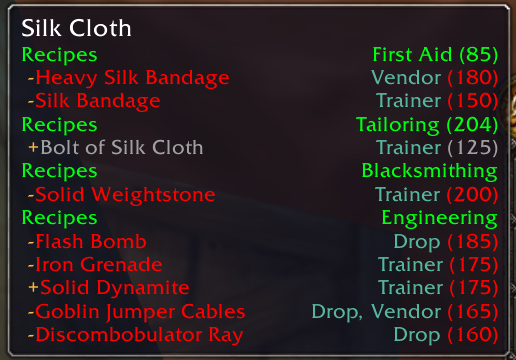
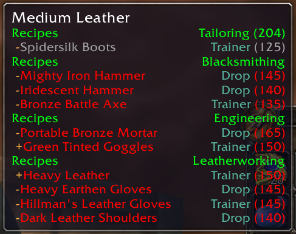
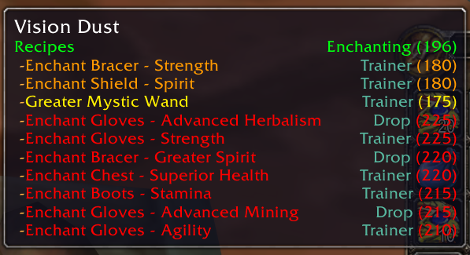

A World of Warcraft: Vanilla and [Turtle WoW](https://turtle-wow.org) addon that enhances the tooltip of trade skill ingredients.

### Features
- Show recipes where the selected ingredient is used in
- Show 'where' you can get the recipe (vendor, quest, etc.)
- Show what tradeskill level is required to use the recipe
- Show current trade skill level
- Show the skill color of the recipe
- Show names of alts who know the recipe
- Show if the recipe is ingredient of another recipe (refer to +/- in front of the recipe)
- Adjustable options (use `/mts options` command)
- Support all your characters on the same realm
- Support custom Turtle WoW recipes

### Usage
- Install the addon
- Hover over an ingredient in the inventory, bank, vendor inventory, etc.
- See the recipes in the tooltip

If you open the tradeskill window after installing the addon, it will scan all your recipes and remember them.

### Screenshots

### Acknowledgments
- Original version: DaDaemon
- [Resurrection and reupload](https://www.curseforge.com/wow/addons/project-2618): [Triadian](https://github.com/Triadian)
- [Ace3v](https://github.com/laytya/Ace3v/) and [LibCrafts](https://github.com/refaim/LibCrafts-1.0) rewrite: [Refaim](https://github.com/refaim)
- German Localization: Farook
- French Localization: Tigaa
- Russian Localization: [KasVital](https://github.com/KasVital), [Refaim](https://github.com/refaim)

### Development Requirements
- [Vanilla-WoW-Lua-Definitions](https://github.com/refaim/Vanilla-WoW-Lua-Definitions)
- [Ace3v-Lua-Definitions](https://github.com/refaim/Ace3v-Lua-Definitions)

### Legacy README from Triadian
> No idea why this mod slipped into non-existance, so i dragged it back kicking and screaming - if you wanna flame me
> for doing you will be ignored at Triadian@Gmail.com i will only be updating at http://ui.worldofwar.net/ui.php?id=2146
> and http://www.curse-gaming.com/en/wow/addons-4773-master-trade-skills.html
> so if you write a comment elsewhere i might not see it.
> 
> any nice suggestions or improvements let me know and i'll try and implement them
> but my knowledge of UI isn't that brilliant.
> 
> German Localization by Farook. Thanks
